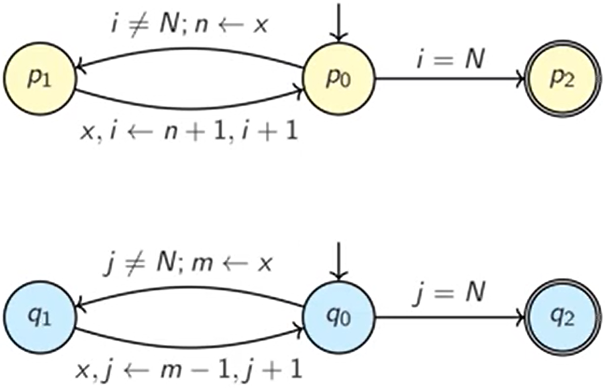

# Concurrency

Concurrency is an abstraction allowing programs to be structured as multiple processes.

## Symbols

- $\cap$ : and
- $\cup$ : or
- $\implies$ : implies
- $\oplus$ : exlusive or
- $\top$ : truth
- $\bot$ : falsity
- $\llbracket P \rrbracket$ : semantics of $P$ (a program)
- $\models$ : models, entails
- $\circ$ : function composition

## 3 R's

1. Reading concurrent code and programming idioms in a variet of execution contexts.
1. wRiting concurrent software using various abstractions for synchronisation.
1. Reasoning about concurrent systems with formal proof and automatic analysis tools.

## Process Models

Multithreaded process model:


Parallel multiprocess model:


Parallel distributed multiprocess model:


## Sequential Program

A sequential program consists of a sequence of actions which are completed in total order.


Sequential program reasoning can be represented by the Hoare logic:
$$
\{\phi\}P\{\psi\}
$$

Where:
- $\phi$ is the set of pre-conditions.
- $P$ is the program.
- $\psi$ is the set of post-conditions.

> Program $\left(P\right)$ is a piece of text.

## Dining Cryptographers Problem

Consider the dining cryptographers problem where the cryptographers, $C_{1}, C_{2}, C_{3}$, determines if their dinner was paid for anonymously by either one of the three cryptographers or the NSA:
- Each $C_{i}$ tosses a coin, $t_{i}$.
- Each $C_{i}$ tells what they tossed only to their right.
- Each $C_{i}$ announces (if they paid), if the two coin tosses are "equal" or "different" unless they did not pay then they announce the opposite.
- If there is an even number of "different" announcements, $a_{i}$, then the NSA paid.
- If there is an odd number of "different" announcements then one of $C_{i}$ paid.

Claim:
$$
a_{1} \oplus a_{2} \oplus a_{3} = \top \iff \text{ there's an odd number of diffs}
$$

Test:
$$
\begin{aligned}
\bot \oplus \bot \oplus \bot &= \bot \oplus \bot = \bot \text{ for no diffs} \\
\top \oplus \top \oplus \top &= \bot \oplus \top = \top \text{ for one diff}
\end{aligned}
$$

Define the announcements in terms of the tosses:
$$
\begin{aligned}
a_{1} \oplus a_{2} \oplus a_{3} &= (t_{1} \oplus t_{3}) \oplus (t_{2} \oplus t_{1}) \oplus (t_{3} \oplus t_{2}) \\
&= (t_{1} \oplus t_{2} \oplus t_{3}) \oplus (t_{1} \oplus t_{2} \oplus t_{3}) \\
&= \bot
\end{aligned}
$$

It is clear to see that if one of $C_{i}$ paid then they must lie which negates their announcement and thus the result. Otherwise the NSA paid.

## Concurrent Program

A concurrent program consists of a series of actions which are completed in partial order.


> Don't care about what our process models look like because concurrency is an abstraction.

## Interleaving

Partial order is achieved by interleavings.

Interleavings are a logical device that makes it possible to analyse the correctness of concurrent programs.

Interleavings gives rise to a "behaviour".

> Basic problem of concurrent programming is identifying which activities may be done concurrently.

---

Suppose $P = \{ P_{1}, P_{2} \}$. $P$ executes any one of the execution sequences that can be obtained by interleaving the execution sequences of $P_{1}$ and $P_{2}$.
    
Consider any instructions $I_{1}$ and $I_{2}$ from $P_{1}$ and $P_{2}$ respectively.

If $I_{1}$ and $I_{2}$ do not access the same memory cell then it does not matter the order of execution of $I_{1}$ and $I_{2}$.

Suppose $I_{1}$ and $I_{2}$ do writes to the same memory cell, $M$. If $I_{1}$ and $I_{2}$ executed simultaneously then the result is consistent i.e. $M$ will contains either $I_{1}$'s value or $I_{2}$'s value and $M$ does not contain any other value. If $M$ contains $I_{1}$'s value then this is equivalent to saying $I_{1}$ occurred before $I_{2}$ in an interleaving and vice versa.

If the above is not true then it would be impossible to reason about concurrent programs.

---

> Concurrent programs are non-deterministic as there are multiple possible interleavings.

### Synchronisation

Processes need to communicate to organise and coordinate actions.

The red arrows in the concurrent program diagram are synchronisations.

Types of communication:
- Shared Variables: Typically on single-computer execution models.
- Message-Passing: Typically on distributed execution models.

## Behaviour

Behaviour is an infinite sequence of states.

$\Sigma^{\omega}$ captures the set of all behaviours.

> $\Sigma$ is a state.

## Semantics

Semantics $\left(\llbracket P \rrbracket\right)$ of a program is a set of behaviours.

Hoare logic does not work for concurrent programs because they cannot rely on pre-conditions and post-conditions, require intermediate states, and may not terminate.

It is better to reason concurrent programs by defining $\llbracket P \rrbracket$ as the set of all possible behaviours from all different available interleavings of actions.

## Models

Models are used to give semantics to logic e.g.:
$$
\begin{aligned}
\overbrace{\mathcal{V}}^{\text{model}} \models \overbrace{\rho}^{\text{logic}} &\iff \overbrace{\rho \in \mathcal{V}}^{\text{semantics}} \\
\mathcal{V} \models \phi \land \psi &\iff \mathcal{V} \models \phi \text{ and } \mathcal{V} \models \psi \\
\end{aligned}
$$

## Internal vs External State

We sometimes want to hide states.

If we abstract away all internal states, actions that only affect internal states will appear not to change the state at all.

> Stuttering is a finite repetition of the same state.

## Cantor's Uncountability Argument

It is impossible to enumerate the space of all behaviours.

> Uncountable means no bijection between sets of properties and the set of natural numbers ($\implies$ something is infinite).

## Limits

To address Cantor's uncountability argument, we just make finite observations.

The limit closure of $A$ i.e. $\overline{A}$ is the set of all behaviours that are indistinguishable from a behaviour in $A$ if finite observations are made.

The limit closure of $A$ i.e. $\overline{A}$ is the smallest closed set containing $A$, which is also the intersection of all closed sets containing $A$.

$$
A \subseteq \overline{A}
$$

The limit closure of a set $A \subseteq \Sigma^{\omega} = \overline{A}$ where:
$$
\overline{A} = \left\{
    \begin{aligned}
    \sigma &\in \Sigma^{\omega} | \forall n \in \mathbb{N} \\
    \exists \sigma' &\in A \\
    \left. \sigma \right|_{n} &= \left. \sigma' \right|_{n}
    \end{aligned}
    \right\}
$$

> $\left. \sigma \right|_{k}$ denotes the prefix of the behaviour, $\sigma$, for the first $k$ states.

> Set $A$ of behaviours is limit closed if $\overline{A} = A$.

> Set $A$ is dense if $\overline{A} = \Sigma^{\omega}$ i.e. the closure is the space of all behaviours.

### Example 1

$$
\overline{\emptyset} = \emptyset
$$

### Example 2

Let $\Sigma = \{0, 1\}$, and let $A$ be the set of all behaviours that start with a finite number of 0's; followed by infinitely many 1's. What is $\overline{A}$?

If:
$$
A = \left(\overbrace{0, ...}^{0 \text{ to } k \text{ times}}, \overbrace{1, ...}^{\infin \text{ times}}\right)
$$

Then:
$$
\overline{A} = \left\{\overbrace{0, ...}^{0 \text{ to } \infin \text{ times}}, \overbrace{1, ...}^{\infin \text{ times}}\right\}
$$

## Property

A property $\left(A\right)$ of a program is a set of behaviours:
$$
\llbracket P \rrbracket \subseteq A
$$

> The above works for correctness properties but not for security or real-time properties.

We specify systems with *temporal properties* to achieve the above by using either *safety* or *liveness* properties.

### Safety Property

A safety property states that something will **never** happen.

> It can be violated.

Safety properties are limit closed.

---
Let $P$ be a safety property.

Assume $\exists$ a behaviour $\sigma_{\omega} \in \overline{P}$ s.t. $\sigma_{\omega} \notin P$. For $\sigma_{\omega}$ to violate $P$, there must be a specific violating state in $\sigma_{\omega}$ i.e. $\exists k$ where $\sigma_{\omega}|_{k} \notin P$.

Since $\sigma_{\omega} \in \overline{P}$, there must be a behaviour $\sigma \in P$ s.t. $\sigma_{\omega}|_{k} = \sigma|_{k}$.

Thus $\sigma$ both violates and satisfies the property $P$.

---

### Liveness Property

A liveness property states that something will **eventually** happen.

> It cannot be violated.

Liveness properties are dense.

---

Let $P$ be a liveness property.

If $\sigma \in P$, then $\sigma \in \overline{P} \because P \subseteq \overline{P}$.

If $\sigma \notin P$, then $\nexists k$ where $\sigma|_{k} \in P$. However, every finite prefix $\sigma|_{i} \subseteq \sigma$ could be extended differently with some $\rho_{i}$ s.t. $\sigma|_{i\rho_{i}} \in P$. Therefore, $\sigma \in \overline{P}$.

---

## Alpern and Schneider's Theorem

Every property is the intersection of a safety and a liveness property.

---

$$
\begin{aligned}
P &= \overbrace{\overline{P}}^{\text{closed}} \cap \overbrace{\Sigma^{\omega} \setminus (\overline{P} \setminus P)}^{\text{dense}} \\
&=  \overline{P} \cap \Sigma_{\omega} \setminus (\overline{P} \cap P^{c}) \\
&=  \overline{P} \cap \Sigma_{\omega} \cap (\overline{P} \cap P^{c})^{c} \\
&=  \overline{P} \cap \Sigma_{\omega} \cap (\overline{P}^{c} \cup P) \\
&=  \overline{P} \cap (\overline{P}^{c} \cup P) \\
&=  (\overline{P} \cap \overline{P}^{c}) \cup (\overline{P} \cap P) \\
&= \overline{P} \cap P \\
&= P \because P \subseteq \overline{P} \\
\end{aligned}
$$

---

Theorem gives separation of concerns and allows different proof techniques to be used:
- Concurrent program suggests correct actions (safety).
- Scheduler chooses which actions to take (liveness).

### Example 1

The program will stay in state $s_{1}$ for a while then go to state $s_{2}$ forever.

- Safety: $s_{2}$ will never occur before $s_{1}$.
- Liveness: $s_{1}$ will eventually transition to $s_{2}$.

### Example 2

The program will allocate exactly 100 MB of memory.

- Safety: The program allocates exactly 100 MB of memory.
- Liveness: The program will eventually allocate memory.

### Example 3

If given an invalid input, the program will return the value -1.

- Safety: Program returns -1 after seeing an invalid input.
- Liveness: Program after seeing an invalid input, it will eventually return something.

## Linear Temporal Logic

Linear temporal logic (LTL) describes linear time properties and is able to describe behaviours.
 
> Propositional logic describes boolean expressions.

### Syntax

Normal propositional operators:
- $\rho \in \mathcal{P}$ is an LTL formula.
- If $\phi, \psi$ are LTL formulae, then $\phi \land \psi$ is an LTL formula.
- If $\phi$ is an LTL formula, $\neg \phi$ is an LTL formula.

Modal (temporal) operators:
- If $\phi$ is an LTL formula, then $\bigcirc \phi$ is an LTL formula.
- If $\phi, \psi$ are LTL formulae, then $\phi \; \mathcal{U} \; \psi$ is an LTL formula.

> $\bigcirc \phi$ : In the next state, $\phi$ holds.

> $\phi \; \mathcal{U} \; \psi$ :  $\phi$ will hold for a finite amount of states; then, $\psi$ will hold after that.

### Semantics

LTL models are behaviours:
- $\sigma \models \rho \iff \rho \in \sigma_{0}$
- $\sigma \models \rho \land \psi \iff \sigma \models \phi \text{ and } \sigma \models \psi$
- $\sigma \models \neg \phi \iff \sigma \not\models \phi$
- $\sigma \models \bigcirc \phi \iff \sigma|_{1} \models \phi$
- $\sigma \models \phi \; \mathcal{U} \; \psi \iff \exists i \text{ s.t. } \sigma|_{i} \models \psi \text{ and } \forall j < i, \; \sigma|_{j} \models \phi$

> $\sigma|_{n}$ denotes the suffix of $\sigma$ starting at $n + 1$ i.e. drops the first $n$ states. It does not note the prefix, we can tell the difference based on context that this is modelling.

> Propositional logic models were sets of propositional atoms.

> $\Diamond \phi = \top \; \mathcal{U} \; \phi $ : $\phi$ will eventually be true at some point.

> $\Box \phi = \neg(\Diamond(\neg \phi))$ : $\phi$ will always be true from now on.

LTL cannot express branching-time properties. <!-- Explain this? -->

#### Proof 1

Prove:
$$
\Box \phi = \neg (\Diamond \neg \phi)
$$

Consider:
$$
\sigma \models \phi \iff \sigma \models \psi
$$

Proof:
$$
\begin{aligned}
\sigma \models \neg(\Diamond \neg \phi) &= \neg (\sigma \models \Diamond \neg \phi) \\
&= \neg (\exists i. \; \sigma|_{i} \models \neg \phi) \\
&= \neg (\exists i. \; \neg(\sigma|_{i} \models \phi)) \\
&= \forall i. \; \neg \neg(\sigma|_{i} \models \phi) \\
&= \forall i. \; \sigma|_{i} \models \phi \\
&= \Box \phi \\
\end{aligned}
$$

> Note that we use two layers of logic for our proof i.e. metalogic ($\forall, \exists, ...$) and object logic ($\Diamond, \Box, ...$).

#### Proof 2

Prove:
$$
\Box(\phi \land \psi) = \Box\phi \land \Box\psi
$$

Proof:
$$
\begin{aligned}
\sigma \models \Box(\phi \land \psi) &= \forall i. \; \sigma|_{i} \models \phi \land \psi \\
&= \forall i. \; ((\sigma|_{i} \models \phi) \land (\sigma|_{i} \models \psi)) \\
&= (\forall i. \; \sigma|_{i} \models \phi) \land (\forall i. \; \sigma|_{i} \models \psi) \\
&= \sigma \models \Box\phi \land \sigma \models \Box\psi \\
&= \sigma \models \Box\phi \land \Box\psi \\
\end{aligned}
$$

> $\Box\Diamond\phi$ : infinitely often, always eventually.

> $\Diamond\Box\phi$ : almost globally, always true from some point onwards, eventually reach a state where its always true.

## Why Concurrency?

How many scenarios are there for a program with $n$ finite processes consisting of $m$ atomic actions each?

$$
\frac{(nm)!}{m!^{n}}
$$

For 6 processes consisting of 6 sequential atomic actions each, there are 2 670 177 736 637 149 247 308 800 scenarios...

It is infeasible to test all possible scenarios so we apply *formal methods*.

## Model Checking

Given a program, $P$, and property, $\phi$, exhaustingly searches the state-space for a counter-example to $\phi$.

Pros:
- Easy to use push-button technology.
- Instructive counter-examples (error traces) help debugging.

Cons:
- State explosion problem (infeasible to model check in reasonable time).

> Not learning how to write a model checker in this course. Just how to use one i.e. Promela.

## Theorem Proving

Construct a (formal) proof for $P$.

Pros:
- No (theoretical) limits on state-spaces.
- Can learn why theorem holds.

Cons:
- Requires expert users to hand-crank thorough proofs.

## Promela

### Volatile Variables

Sometimes we cannot guarantee that a statement is executed atomically (i.e. in one step). This is statement is called the *limit critical reference restriction*.

We require each statement to only access at most one shared variable at a time to overcome volatile variables.

In the following example, each statement, access a single variable:
```promela
do
:: i < 10 ->
    temp = c;
    c = temp + 1;
od
```

### Ensuring Atomicity

Grouping statements with `atomic` prevents them from being interrupted:
```promela
atomic {
    run P();
    run P();
}
```
If a statement in the atomic block is blocked, then atomicity is temporarily suspended and another process may run

Grouping statements with `d_step` is more efficient than `atomic` because it groups them into a single transition:
```promela

```
<!-- TODO -->
If a statement in the d_step block is blocked, then runtime error is raied. `if` and `do` is not allowed.

> `d_step` stands for deterministic step.

## Atomicity

Critical section problems tend to look like this (in the real world):

```
forever do
    non-critical section
    pre-protocol
    critical section
    post-protocol
```

Non-critical section models the possibility that a process may do something else (maybe taking a finite or infinite amount of time).

## Critical Section Desiderata

Properties that we want to always be true when solving critical section problems.

We want to find pre- and post-protocols such that certain **atomicity properties** are satisfied.

### Safety Desiderata

- **Mutual Exclusion**: No two properties are in the critical section at the same time.
- **Absence of Deadlock**: System should never reach a state where there are no actions.

### Liveness Desiderata

- **Eventual Entry**: Once a process enters its pre-protocol, it will eventually execute its critical section.
- **Absence of Unnecessary Delay**: If only one process is attempting to enter its critical section, it succeeds.
- **Bounded Waiting**: Once a process enters its pre-protocol, it can be *bypassed* by other processes at most $f(n)$ times for some $f$ where $n$ is number of processes.
- **Linear Waiting**: No process can enter its critical section twice while another process is in its pre-protocol.

## Dekker's Algorithm

A solution to the mutual exclusion problem and satisfying all the above atomicity properties:

```
forever do
    non-critical section
    wantp = True;            // Flag intent that this process wants to do work.
    while wantq do           // Let other process do work.

        // We have the following block in case both processes are in the while loop.
        // This avoids livelock.
        if turn = 2 then     // If it's their turn.
            wantp = False;   // State that we don't want it.
            await turn = 1;  // Wait until it's our turn.
            wantp = True;    // State that we want it now.
    critical section
    turn = 2;                // Their turn now.
    wantp = False;           // We don't want to go into critical section anymore.
```

## Fairness

Weak fairness for an action, $\pi$:
$$
\Box(\Box\text{enabled}(\pi) \implies \Diamond\text{taken}(\pi))
$$

> If an action is always enabled then it will eventually happen.

Strong fairness for an action, $\pi$:
$$
\Box(\Box\Diamond\text{enabled}(\pi) \implies \Diamond\text{taken}(\pi))
$$

> No action can be enabled infinitely often without being executed.

## Transition Diagrams

A transition diagram is a tuple:
$$
(L, T, s, t)$$

Where:
- $L$ is a set of locations (program counter values).
- $T$ is a set of transitions.
- $s \in L$ is an entry location.
- $t \in L$ is an exit location.

A transition is expressed as:
$$
l_{i} \xrightarrow{g; f} l_{j}
$$

Where:
- $l_{i}$ and $l_{j}$ are locations.
- $g$ is a guard, $\Sigma \rightarrow \mathbb{B}$.
- $f$ is a state update, $\Sigma \rightarrow \Sigma$.

> For $g; f$, if $g = \top$, then write $f$.

> For $g; f$, if $f$ is identity, then write $g$.

### Example 1

```
l0  i = 0;
l1  s = 0;
l2  while i != N do
        s = s + 1;
l3      i = i + 1;
    od
```


<!-- TODO UPDATE DIAGRAM -->

## Floyd Verification

Given a transition diagram, $(L, T, s, t)$:
1. Associate each location $l \in L$ with an assertion, $\mathcal{Q}(l): \Sigma \rightarrow \mathbb{B}$.
2. Prove that this assertion network is inductive i.e. for each transition in $T$, $l_{i} \xrightarrow{g; f} l_{j}$, show that:
$$
\mathcal{Q}(l_{i}) \land g \Rightarrow \mathcal{Q}(l_{j}) \circ f
$$

> If annotation at $l_{i}$ is true and guard is true, then after updating the state with $f$, the annotation at $l_{j}$ must be true.

3. Show that $\phi \Rightarrow \mathcal{Q}(s)$ and $\mathcal{Q}(t) \Rightarrow \psi$.

> Annotations are also called an assertion network.

> Floyd's method is a theorem proving technique.

### Example 1


<!-- TODO UPDATE DIAGRAM -->

Let $P$ be the whole transition diagram.

Prove:
$$
\{\top\}P\{s = \frac{N(N - 1)}{2}\}
$$

Proof is done by finding an "annotation" for every location - annotation should state something that's always true at that location:
- Pre-condition implies the start location's annotation.
- Exit location's annotation implies the post-condition.
- If current location's annotation is true, then if we take a transition, the next location's annotation becomes true.

Proof:
$$
\begin{aligned}
l_{0}&: \top \\
l_{1}&: i = 0 \\
l_{2}&: s = \frac{i(i - 1)}{2} \\
l_{3}&: s = \frac{(i + 1)i}{2} \\
l_{4}&: s = \frac{N(N - 1)}{2} \\
\end{aligned}
$$

Considering $l_{1} \rightarrow l_{2}$, we must prove:
$$
\begin{aligned}
i &= 0 \rightarrow s = \frac{i(i - 1)}{2} \\
\text{Let } s = 0 \text{: } i &= 0 \rightarrow 0 = \frac{i(i - 1)}{2} \\
\end{aligned}
$$

Considering $l_{2} \rightarrow l_{3}$, we must prove:
$$
\begin{aligned}
s = \frac{i(i - 1)}{2} \land i \neq N \rightarrow s + i = \frac{(i + 1)i}{2} \\
\end{aligned}
$$

## Concurrent Transition Diagrams

Given two processes $P$ and $Q$ with transition diagrams $(L_{P}, T_{P}, s_{P}, t_{P})$ and $(L_{Q}, T_{Q}, s_{Q}, t_{Q})$, the parallel composition of $P$ and $Q$, $P \; \| \; Q$, is defined as $(L, T, s, t)$ where:
- $L = L_{P} \times L_{Q}$
- $s = s_{P}s_{Q}$
- $t = t_{P}t_{Q}$
- $p_{i}q_{i} \xrightarrow{g; f} p_{j}q_{i} \in T \text{ if } p_{i} \xrightarrow{g; f} p_{j} \in T_{P}$
- $p_{i}q_{i} \xrightarrow{g; f} p_{i}q_{j} \in T \text{ if } q_{i} \xrightarrow{g; f} q_{j} \in T_{Q}$


> Every horizontal transition belongs to the horizontal process. Every vertical transition belongs to the vertical process.

Floyd's verification can be applied on basic concurrent programs after taking the parallel composition. However, not feasible because of state-space explosion.

## Owicki-Gries Method

The Owicki-Gries method generalises verifying concurrent programs to $n$ processes, by requiring more interference freedom obligations.



To show $\{\phi\} P \; \| \; Q \{\psi\}$:
1. Define local assertion networks $\mathcal{P}$ and $\mathcal{Q}$ for $P$ and $Q$.
2. Show $\mathcal{P}$ and $\mathcal{Q}$ are inductive.
3. For each location $p \in L_{P}$, show that $\mathcal{P}(p)$ is not falsified by any transition of $Q$ i.e.:
$$
\forall q \xrightarrow{g; f} q' \in T_{Q}: \mathcal{P}(p) \land \mathcal{Q}(q) \land g \Rightarrow \mathcal{P}(p) \circ f
$$
4. Do the same for $Q$.
5. Show that $\phi \Rightarrow \mathcal{P}(s_{P}) \land \mathcal{Q}(s_{Q})$ and $\mathcal{P}(t_{P}) \land \mathcal{Q}(t_{Q}) \Rightarrow \psi$.

> Owicki-Gries method is a theorem proving technique.

### Proving Mutual Exclusion

Don't have a post-condition.

Make the assertions at the critical sections contradictory so they cannot be true simultaenously.

Ensure that each transition does not violate limited critical reference rule.

#### Example 1

##### Manna-Pnueli Algorithm

Consider the Manna-Pnueli algorithm:

Initialise:
```
wantp = 0
wantq = 0
```

Process $P$:
```
    forever do
p1      non-critical section
p2      if wantq == -1
            wantp = -1
        else
            wantp = 1
p3      await wantq != wantp
p4      critical section
p5      wantp = 0
```

Process $Q$:
```
    forever do
q1      non-critical section
q2      if wantp == -1
            wantq = 1
        else
            wantq = -1
q3      await wantq != -wantp
q4      critical section
q5      wantq = 0
```

> $p_{2}$ and $q_{2}$ are one atomic step.

##### Check $P$'s annotations are Inductive

Define the annotations for process $P$:
- $p_{1}$: $\text{wantp} = 0$
- $p_{2}$: $\text{wantp} = 0$
- $p_{3}$: $\text{wantp} \neq 0$
- $p_{4}$: $\text{wantp} \neq 0 \land \text{wantq} \neq \text{wantp}$
- $p_{5}$: $\top$

<!-- TODO: induction -->

##### Check $Q$'s annotations are Inductive

Define the annotations for process $Q$:
- $q_{1}$: $\text{wantq} = 0$
- $q_{2}$: $\text{wantq} = 0$
- $q_{3}$: $\text{wantq} \neq 0$
- $q_{4}$: $\text{wantq} \neq 0 \land \text{wantp} \neq -\text{wantq}$
- $q_{5}$: $\top$

<!-- TODO: induction -->

##### Check for Interference

Suppose $P$ is at location $p_{4}$. Then:
$$
\text{wantp} \neq 0 \land \text{wantq} \neq \text{wantp}
$$

Check that $Q$ cannot falsify the above annotation. We only have to consider locations $q_{2}$ and $q_{5}$ since other locations do not have writing annotations.

For $Q$ at location $q_{5}$:
$$
\text{wantp} \neq 0 \land \text{wantq} \neq \text{wantp} \land \top \implies \text{wantp} \neq 0 \land 0 \neq \text{wantp}
$$

For $Q$ at location $q_{2}$:
$$
\text{wantp} \neq 0 \land \text{wantq} \neq \text{wantp} \land \text{wantq} = 0 \land \text{wantp} \neq -1 \implies \text{wantp} \neq 0 \land 1 \neq \text{wantp}
$$

<!-- TODO: prove for each location in P and Q -->

##### Check Mutual Exclusion Holds

Prove the algorithm is mutually exclusive by showing $P$ at location $p_{4}$ and $Q$ at location $q_{4}$ cannot both be true.

<!-- TODO: Proof -->

## Machine Instructions

If `XC` was a machine instruction that could atomically swap two values, then a critical section solution can be:

```
bit common = 1
```

```
    bit tp = 0
    forever do
p1      non-critical section
        repeat
p2          XC(tp, common)
p3      until tp = 1
p4      critical section
p5      XC(tp, common)
```

```
    bit tq = 0
    forever do
q1      non-critical section
        repeat
q2          XC(tq, common)
q3      until tq = 1
q4      critical section
q5      XC(tq, common)
```

## Invariants

An invariant is an assertion network where every assertion is the same.

Do not need to prove interference freedom.

### Example 1 - Exchange-Based Critical Section Solution

Consider the `XC` example:

$$
\mathcal{I} \equiv (\text{common} \oplus \text{tp} \oplus \text{tq}) = 1 \land (P@p_{4} \implies \text{tp} = 1) \land (Q@q_{4} \implies \text{tq} = 1) \land \neg (\text{common} = \text{tp} \land \text{common} = \text{tq})
$$

Note that $\mathcal{I}$ is false at $p_{4}q_{4}$.

## Peterson's Algorithm for 2 Processes

```
boolean wantp = false
boolean wantq = false
integer last = 1
```

Process $P$:
```
    forever do
p1      non-critical section
p2      wantp = true
p3      last = 1
p4      await wantq = false or last != 1
p5      critical section
p6      wantp = false
```

Process $Q$:
```
    forever do
q1      non-critical section
q2      wantq = true
q3      last = 2
q4      await wantp = false or last != 2
q5      critical section
q6      wantq = false
```

## Peterson's Algorithm for $n$ Processes

```
integer array in[1..n] = [0, ..., 0]
integer array last[1..n] = [0, ..., 0]
```

Process $P_{i}$:
```
    forever do
p1      non-critical section
        for all j in {1..n-1}
p2      in[i] = j
p3      last[j] = i
        for all processes k != i
p4          await in[k] < j or last[j] != i
p5      critical section
p6      in[i] = 0
```

### Problems

- Has $O(n^{2})$ pre-protocol.

Satisfies eventual entry but does not satisfy bounded waiting nor linear waiting.

## Simplified Bakery Algorithm for 2 Processes

Simplified because of grouping of statements that cannot be atomic.

```
integer np = 0
integer nq = 0
```

Process $P$:
```
    forever do
p1      non-critical section
p2      np = nq + 1
p3      await nq == 0 or np <= nq
p4      critical section
p5      np = 0
```

Process $Q$:
```
    forever do
q1      non-critical section
q2      nq = np + 1
q3      await np == 0 or nq < np
q4      critical section
q5      nq = 0
```

Invariants:
$$
\begin{align}
\text{np} = 0 \iff P@p1 \lor P@p2 \\
\text{nq} = 0 \iff Q@q1 \lor Q@q2 \\
P@p4 \implies \text{nq} = 0 \lor \text{np} \leq \text{nq} \\
Q@q4 \implies \text{np} = 0 \lor \text{nq} < \text{np} \\
\end{align}
$$

Proving all the above invariants shows:
$$
\neg(P@p4 \land Q@q4)
$$

### Problems

- `np` and `nq` can grow unboundedly large (practically unlikely though).

### Proving Deadlock Freedom

Consider the disjunction of the conditions on the `await` statement i.e. $p_{3}$ and $q_{3}$:
$$
\text{nq} = 0 \lor \text{np} \leq \text{nq} \lor \text{np} = 0 \lor \text{nq} < \text{np}
$$

The disjunction is equivalent to $\top$, therefore it is not possible for both proceses to be blocked there.

> Analogy is a process grabs a ticket number that is incrementing.

## Simplified Bakery Algorithm for $n$ Processes

```
integer array[1..n] number = [0, ..., 0]
```

Process $P_{i}$:
```
    forever do
p1      non-critical section
p2      number[i] = max(number) + 1
p3      for all other processes j
p4          await (number[j] = 0) or (number[i] << number[j])
p5      critical section
p6      number[i] = 0
```

Where:
$$
a[i] \ll a[j] \iff (a[i] < a[j]) \lor (a[i] = a[j] \land i < j)
$$

## Lamport's Bakery Algorithm

```
boolean array[1..n] choosing = [false, ..., false]
integer array[1..n] number = [0, ..., 0]
```

Process $P_{i}$:
```
    forever do
p1      non-critical section
p2      choosing[i] = true
p3      number[i] = 1 + max(number)
p4      choosing[i] = false
p5      for all other processes j
p6          await choosing[j] == false
p7          await (number[j] == 0) or (number[i] << number[j])
p8      critical section
p9      number[i] = 0
```

We ensure that processes do not pick the same ticket number.

Algorithm does not assume that read and write operations are atomic (when choosing a ticket). If read and write occurred simultaenously then write operation is performed correctly and read may return an arbitrary value.

## Fast Lamport's Bakery Algorithm for 2 Processes

Remove contention when trying to access critical section.

```
integer gate1 = 0
integer gate2 = 0
```

Process $P$:
```
    forever do
        non-critical section
p1      gate1 = p
p2      if gate2 != 0 goto p1
p3      gate2 = p
p4      if gate1 != p
p5          if gate2 != p goto p1
        critical-section
p6      gate2 = 0
```

Process $Q$:
```
    forever do
        non-critical section
q1      gate1 = q
q2      if gate2 != 0 goto q1
q3      gate2 = q
q4      if gate1 != q
q5          if gate2 != q goto q1
        critical-section
q6      gate2 = 0
```

This algorithm is almost correct because $P$ can reach its critical-section where $Q@q3 \lor Q@q4 \lor Q@q6$.

> Analogy is process marks a gate with their name then moves forward to next gate. If the previous gate still has their name on it, they can move forward. Otherwise, they start again.

### Proving Eventual Entry is not Satisfied

Consider the partial order:
$$
p_{1} \\
q_{1}q_{2}q_{3}q_{4}q_{6}q_{1} \\
q_{1}q_{2}q_{3}q_{4}q_{6}q_{1} \\
\vdots
$$

$p_{2}$ could be executed between $q_{3}$ and $q_{4}$:
$$
p_{1}q_{1}q_{2}q_{3}p_{2}q_{4}q_{6}q_{1} \\
p_{1}q_{1}q_{2}q_{3}p_{2}q_{4}q_{6}q_{1} \\
\vdots
$$

- $Q$ enters the critical section infinitely often.
- $P$ writes its name on `gate1` infinitely often but it's always instantly overwritten.
- $P$ reads `gate2` infinitely often but always right after $q$ wrote there.

Hence this algorithm does not satisfy eventual entry under weak fairness.

> But it does satisfy deadlock freedom.

### Problems

- Sacrifices eventual entry.

## Fast Correct Lamport's Bakery Algorithm for 2 Processes

```
integer gate1 = 0
integer gate2 = 0
boolean wantp = false
boolean wantq = false
```

Process $P$:
```
    forever do
        non-critical section
p1      gate1 = p
        wantp = true
p2      if gate2 != 0
            wantp = false
            goto p1
p3      gate2 = p
p4      if gate1 != p
            wantp = false
            await wantq == false
p5          if gate2 != p goto p1
            else wantp = true
        critical-section
p6      gate2 = 0
        wantp = false
```

Process $Q$:
```
    forever do
        non-critical section
q1      gate1 = q
        wantq = true
q2      if gate2 != 0
            wantq = false
            goto q1
q3      gate2 = q
q4      if gate1 != q
            wantq = false
            await wantp == false
q5          if gate2 != q goto q1
            else wantq = true
        critical-section
q6      gate2 = 0
        wantq = false
```

To generalise this algorithm for $n$ processes, we need $n$ `want` flags and need to `await` for every process.

Invariants:
$$
\begin{align}
P@p5 \land \text{gate2} = p &\implies \neg(Q@q3 \lor Q@q4 \lor Q@q6) \\
Q@q5 \land \text{gate2} = q &\implies \neg(P@p3 \lor P@p4 \lor P@p6) \\
P@p4 \land \text{gate1} = p &\implies \text{gate2} \neq 0 \\
P@p6 &\implies \text{gate2} \neq 0 \land \neq Q@q6 \land (Q@q3 \lor Q@q4 \implies \text{gate1} \neq q) \\
Q@q4 \land \text{gate1} = q &\implies \text{gate2} \neq 0 \\
Q@q6 &\implies \text{gate2} \neq \land \neq P@p6 \land (P@p3 \lor P@p4 \implies \text{gate1} \neq p)
\end{align}
$$

> Contention: More than one process is in the pre-protocol at a time.

## Szymanski's Algorithm

- Does not have $O(n^{2})$ pre-protocol.
- Does not sacrifice eventual entry.
- Does not have unbounded ticket numbers.
- Does not rely on special instructions (e.g. `xc`, `tc`).
- Enforces linear wait.
- Requires at most $4p - \lceil p/n \rceil$ for $p$ critical section entries by $n$ competing processes.
- Can be immune to process failures, restarts, and read errors occuring during writes.

```
integer array flag[1..n] = [0, ..., 0]
```

```
    forever do
p1      non-critical section
p2      flag[i] = 1
p3      await for all j. flag[j] < 3
p4      flag[i] = 3
p5      if there exists j. flag[j] = 1
p6          flag[i] = 2
p7          await there exists j. flag[j] = 4
p8      flag[i] = 4
p9      await for all j < i. flag[j] < 2
p10     critical-section
p11     await for all j > i. flag[j] < 2 or flag[j] > 3
p12     flag[i] = 0
```

Shared variables:
- `0`: denotes $i$ is in its non-critical section.
- `1`: denotes $i$'s intention to enter the waiting room.
- `2`: denotes $i$ is in the waiting room and waiting for other processes to enter.
- `3`: denotes $i$ has just entered the waiting room and closes the waiting room entry door.
- `4`: denotes $i$ is in the waiting room or critical section and is keeping the waiting room entry door closed.

> Analog is a waiting room with entry and exit. Process announces intention to enter critical section, enters the waiting room through entry door and waits for other processes. Last process to enter the waiting room closes entry door. In order of process IDs, leave waiting room through exit door to enter critical section.

## Hardware Assisted Critical Section Solutions

### Exchange

```
bit common = 1
```

Process $P$:
```
    bit tp = 0
    forever do
p1      non-critical section
        repeat
p2          XC(tp, common)
p3      until tp = 1
p4      critical section
p5      XC(tp, common)
```

Process $Q$:
```
    bit tp = 0
    forever do
p1      non-critical section
        repeat
p2          XC(tp, common)
p3      until tp = 1
p4      critical section
p5      XC(tp, common)
```

#### Problems

Sacrifices eventual entry.

### Test and Set

An `x86` instruction.

$$
\text{TS}(x, y) \equiv x, y \coloneqq y, 1 \text{(atomically)}
$$

```
bit common = 0
```

Process $P$:
```
    bit tp
    forever do
p1      non-critical section
        repeat
p2          TS(tp, common)
p3      until tp = 0
p4      critical section
p5      common = 0
```

Process $Q$:
```
    bit tq
    forever do
q1      non-critical section
        repeat
q2          TS(tq, common)
q3      until tq = 0
q4      critical section
q5      common = 0
```

#### Problems

Sacrifices eventual entry.

## Locks

Locks (mutex) are common means of concurrency control with two actions:
- Pre-protocol: Acquiring the lock.
- Post-protocol: Releasing the lock.

## Semaphores

A semaphore is a pair $(v, L)$ which is always initialised as $(v, \emptyset)$:
- $v$: how many processes we can let in without waiting.
- $L$: how many processes currently waiting to get in.

A process $P$ can do two actions on a semaphore $S$:
- $\text{wait}(S)$: Decrements $v$ if positive, otherwise adds $p$ to $L$ and blocks $p$.
- $\text{signal}(S)$: If $L \neq \emptyset$, unblocks a member of $L$. Otherwise increment $v$.

> A lock is a special case of a binary semaphore

Invariants:
$$
\begin{align}
v &= k + \text{\#signal}(S) - \text{\#wait}(S) \\
v &\geq 0 \\
\text{\#CS} &= \text{\#wait}(S) - \text{\#signal}(S)
\end{align}
$$

> - $\text{\#signal}(S)$ is number of times $\text{\#signal}(S)$ has successfully executed.
> - $\text{\#wait}(S)$ is number of times $\text{\#wait}(S)$ has successfully executed.

### Very Weak Semaphores

- When a signal happens, any one process is unblocked to the state before the wait.
- Processes released before the wait need to try another wait to enter its critical section.
- Does not guarantee eventual entry at all.

### Weak Semaphores

- When a signal happens, any one process is unblocked and released to the state after the wait (i.e. released into the critical section).
- Does not guarantee eventual entry for more than 2 processes.
- Strong fairness does not guarantee linear waiting.

### Strong Semaphores

- When a signal happens, processes are released in FIFO order to the state after the wait.
- Guarantees linear waiting.

## Dining Philosophers Problem

Five philosophers sit around a dining table with a huge bowl of spaghetti in the centre. Five plates and five forks are all laid out evenly. The philosophers can only eat spaghetti with two forks. The philosophers would like to alternate between eating and thinking.

<details><summary>Java Code</summary><p>

```java
import java.util.concurrent.Semaphore;

public Philosopher extends Thread {
    String name;
    Semaphore left_fork;
    Semaphore right_fork;

    Philosopher(String name, Semaphore left_fork, Semaphore right_fork) {
        this.name = name;
        this.left_fork = left_fork;
        this.right_fork = right_fork;
    }

    public void run() {
        System.out.println(name + " thinks...");
        this.sleep();

        System.out.println(name + " grabbed a fork...");
        left_fork.acquireUninterruptedly();
        this.sleep();

        System.out.println(name + " grabbed a another fork...");
        right_fork.acquireUninterruptedly();
        this.sleep();

        System.out.println(name + " eating...");
        this.sleep();

        System.out.println(name + " releases forks...");
        left_fork.release();
        right_fork.release();
        this.sleep();
    }

    // Just for debugging purposes.
    private sleep() {
        try {
            Thread.sleep(150);
        } catch(InterruptedException e) {
        }
    }
}

public class DiningPhilosopher {
    public static void main(String[] args) {
        Semaphore fork1 = new Semaphore(1, false);  // Binary semaphore.
        Semaphore fork2 = new Semaphore(1, false);
        Semaphore fork3 = new Semaphore(1, false);
        Thread t1 = new Philosopher("Hegel", fork1, fork2);
        Thread t2 = new Philosopher("Plato", fork2, fork3);
        Thread t3 = new Philosopher("Averroes", fork3, fork1);
        t1.start();
        t2.start();
        t3.start();
    }
};
```

This code will deadlock because all the philosophers pick up one fork.

</p></details>

### Solving Deadlock

1. Ordering the forks so that:
    ```java
    Thread t1 = new Philosopher("Hegel", fork1, fork2);
    Thread t2 = new Philosopher("Plato", fork2, fork3);
    Thread t3 = new Philosopher("Averroes", fork1, fork3);
    ```
1. Implement another semaphore for eating.

## Rendezvous Problem


Assume the following program:

Process $P$:
```
firstP
secondP
```

Process $Q$:
```
firstQ
secondQ
```

We want `firstP` and `firstQ` to execute before `secondP` and `secondQ`.


<details><summary>Java Code</summary><p>

```java
import java.util.concurrent.Semaphore;

class RendezvousThread extends Thread {
    String name;
    Semaphore s1;

    public RendezvousThread(String name, Semaphore s1) {
        this.name = name;
        this.s1 = s1;
    }

    public void run() {
        System.out.println(name + " first statement");
        s1.release();
        s1.acquireUninterruptibly();
        System.out.println(name + " second statement");
        s1.release();
    }
}

public class Rendezvous {
    public static void main(String[] args) {
        Semaphore s1 = new Semaphore(-1);
        Thread t1 = new RendezvousThread("Bertram", s1);
        Thread t1 = new RendezvousThread("Agatha", s1);
        t1.start();
        t2.start();
    }
}
```

</p></details>

## Producer-Consumer Problem

A producer process and a consumer process share access to a shared buffer of data. The buffer acts as a queue. The producer adds messages to the queue, and the consumer reads messages from the queue. If there are no messages in the queue, the consumer blocks until there are messages.

The producer-consumer problem can be solved using semaphores.

```
queue[T] buffer = empty
semaphore full = (0, null)
```

Producer process:
```
    T d
    forever do
p1      d = produce
p2      append(d, buffer)
p3      signal(full)
```

Consumer process:
```
    T d
    forever do
q1      wait(full)
q2      d = take(buffer)
q3      consume(d)
```

## Producer-Consumer Problem with Finite Buffer

Use another semaphore to indicate whether the buffer is empty.

```
bounded[N] queue[T] buffer = empty
semaphore full = (0, null)
semaphore empty = (N, null)
```

Producer process:
```
    T d
    forever do
p1      d = produce
p2      wait(empty)
p3      append(d, buffer)
p4      signal(full)
```

Consumer process:
```
    T d
    forever do
q1      wait(full)
q2      d = take(buffer)
q3      signal(empty)
q4      consume(d)
```